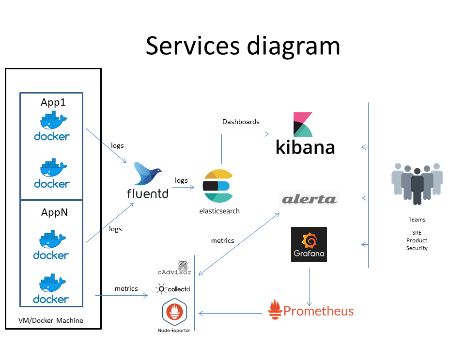
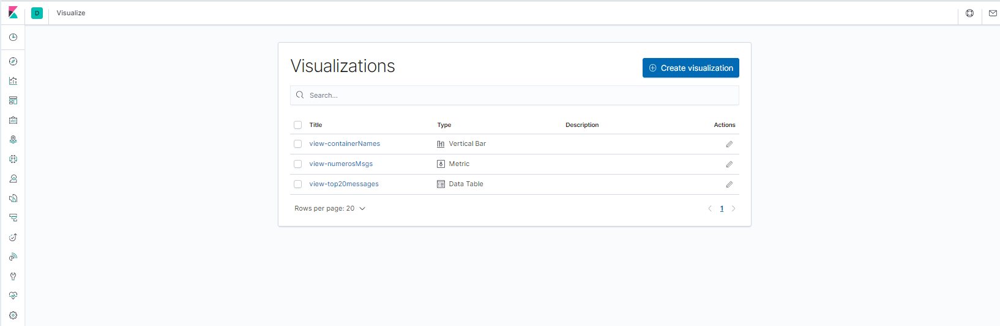

# SRE_Cenario
Infraestrura definida como código para suportar aplicações modernas, obter métricas e logging de forma automatizada e ágil.

# Objetivo 

Este projeto visa provisionar, de forma ágil, serviços que suportem a execução de aplicações coletando seus logs e métricas de infraestrutura.

Para alcançar este objetivo serão instanciados via docker-compose  uma stack de serviços de metrics e loggins compostas por Prometheus, Node-Exporter, Collectd, CAdivisor, Alerta, MongoDB, Grafana, Elasticsearch, Kibana e Fluentd. Com estas ferramentas é possivel a coleta de informações de infra e logs de aplicação de forma automatizada e gerar visualizações ricas em detalhes e em tempo real.

Aplicações das mais diversas linguagens e tecnologias podem ser suportadas por esta pilha de serviços, atendendo o requisito de estarem em execução utilizando container docker e que estes containers usem Fluentd como login driver, os logs e metricas serão coletos.

O macro diagrama dos serviços pode ser representado pela imagem a seguir:

 
 
 Com esta infraestrutura implantada, logs e métricas estarão disponíveis aos diversos times responsáveis por aumentar a confiabilidade das aplicações, em seus diversos aspectos e contornos.
 
 # Deploy do ambiente
 
Para que seja possível o deploy deste ambiente, é necessário ter acesso a uma docker machine **linux**, com credenciais de root, com ambiente docker no **mínimo na versão 18.06.0-ce** e o binário do docker composse na **versão 1.26.0**. Também é necessário o **git** instalado.

**1.** Entre na pasta /usr e execute o git clone para obter o arquivos de implantação.

#cd /usr && git clone https://github.com/jeliasmoreira/sre_cenario.git

**2.** Após o clone do repositório, entre na pasta ./ser_cenario.

#cd ./sre_cenario/

**3.** Proceda agora com a execução do shell script de implantação, que esta no subdir infra.

#sh infra/deploy.sh

Aguarde até o final da execução e uma saída como a seguir será exibida

Os seguintes serviços estao disponiveis
         App Logging
                 Kibana 10.10.10.10:5601
         Infra Metrics
                 Prometheus 10.10.10.10:9090
                 Alerta 10.10.10.10:10081
                 Grafana 10.10.10.10:3000
                 
Esta saída indica que os serviços estão disponíveis e prontos para o uso no **IP:Porta** apresentado.
       
# Visualizações disponíveis e Dashboards 

Os serviços Prometheus, Grafana e Alerta estão disponíveis para os times terem visualizações e dashboards pertinentes a métricas e logs. O serviço alerta requer autenticação.

**Prometheus**

Nesta imagem vemos a “saúde” dos targets cadastrados no Prometheus

Nesta serviço podemos criar consultas seja na sessão de queries ou via Grafana se métricas que são coletadas pelos serviços **Alertmanager**, **Collectd**, **Node-Exporter** e **Grafana**.

A imagem a seguir exibe uma queries coletando os alertas no ambiente e sua origem

**Grafana**

A partir dos dados coletados pelo Prometheus, é possível agora criar dashboards ricos em detalhes visuais para que os times possam ter visibilidade e insights.

Informações da docker machine

Informações dos containers em execução

**Alerta**

O painel Alerta permitir visualizar de forma rica em detalhes os alertas capturados pelo Alert Manager.

Para ter acesso ao dashboard do alerta, é necessário utilizar o usuário admin@alerta.io e a senha alerta

A imagem a seguir exibe informações detalhadas de um alerta.

Dashboards

A ferramenta kibana tem grande poder de gerar visualizações e dashboards, para este ambiente, o fluentd envia os logs coletados dos containers/apps para o elasticsearch e apartir dai o kibana pode gerar visualizações.

O mínimo para termos dashboards são os seguintes itens definidos via kibana. Com seguinte fluxo de dependência entre eles.

Padrão de index -> Visualizações -> Dashboards.

Como exemplo foram criados os seguintes itens.

Padrão de index, fluentd-*

Este item é base para que as visualizações possam coletar de local único as mensagens a serem apresentadas.

Visualizações

A partir do padrão de index, é possível criar visualizações diversas, inclusive multi visão do mesmo dado.

Dashboard

A partir do padrão das visualizações é possível criar agora dashboard para consolidar a visualização das informações. Neste Caso temos no mesmo dashboards a visualização da contagem de mensagens, ao lado o top 20 de mensagens e abaixo um histograma com os container que enviam logs distribuído no tempo.

**Aplicação covid-19api**

Para termos uma aplicação funcional gerando logs, foi implantado um container com a imagem covid-19-api, que tem os seguintes endpoints.

*IP_DE_IMPLANTACAO: 9119/ - Frontend*

*IP_DE_IMPLANTACAO: 9119/ - /all – Retorna informações totalizadas como casos, recuperados, mortes.*

*IP_DE_IMPLANTACAO: 9119/ - /countries –  - Retorna o ranking de países.*

*IP_DE_IMPLANTACAO: 9119/ - /countries/{country-name} - Retorna o infomações especificas do pais em relação ao covid19.*

